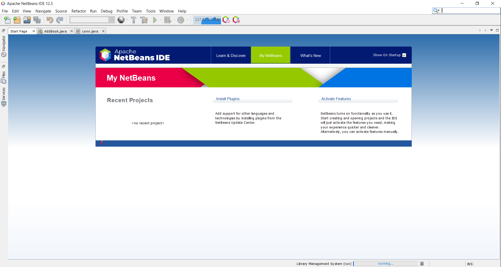
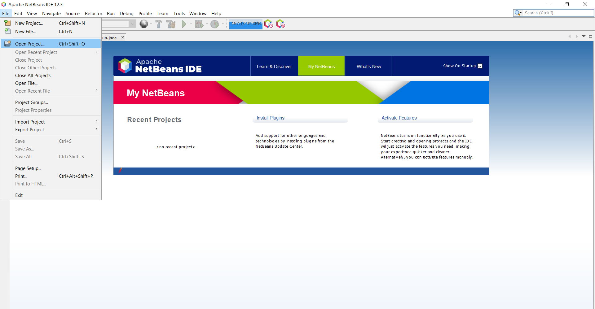
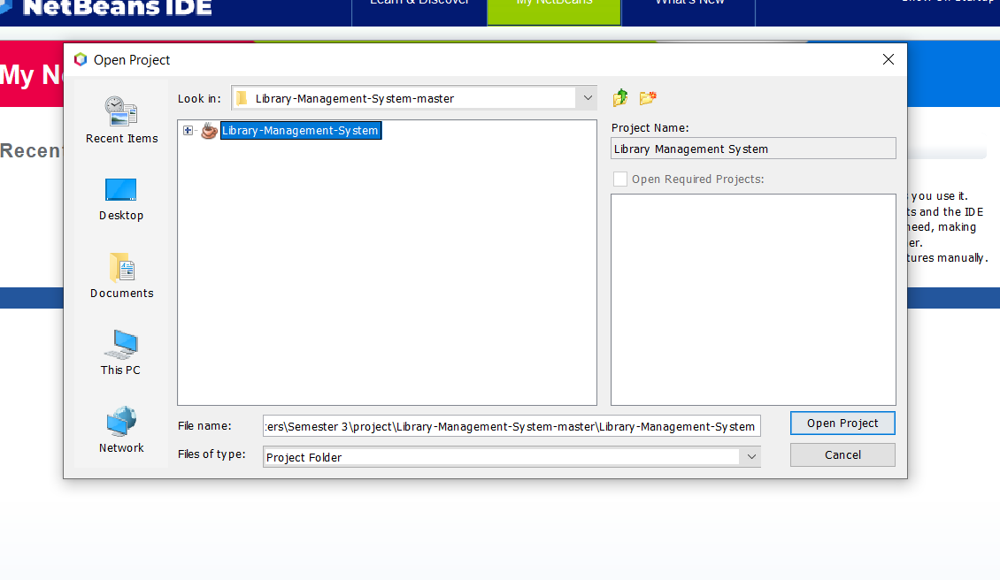
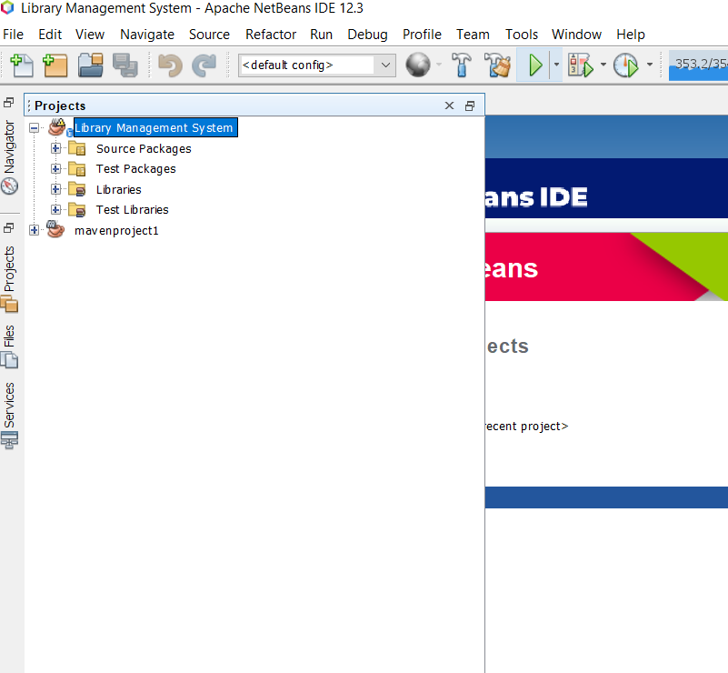
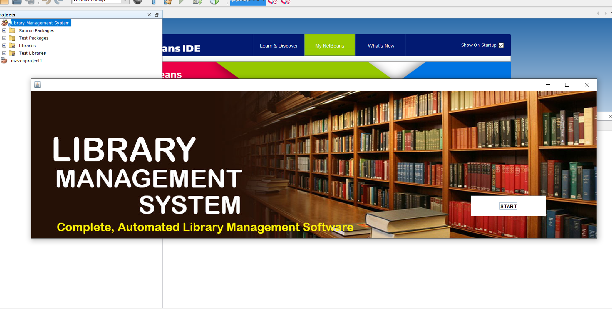
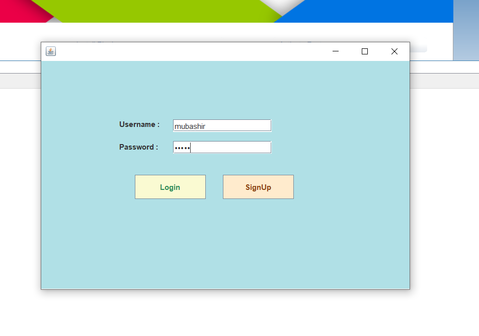

# Library-Management-System
This project is basically on Library Management System which help him to organize data in library. If you wants this software, follow the steps below.

#### If you don't have git on your machine, [install it](https://docs.github.com/en/get-started/quickstart/set-up-git)

## Fork this repository
Fork this repository by clicking on the fork button on the top of this page. This will create a copy of this repository in your account. 


## Clone the repository
Now clone the forked repository to your machine. Go to your GitHub account, open the forked repository, click on the code button and then click the *copy to clipboard* icon.

Open a terminal and run the following git command:
```
git clone "url you just copied"
```


where "url you just copied" (without the quotation marks) is the url to this repository (your fork of this project). See the previous steps to obtain the url.

For example:

```
git clone https://github.com/this-is-you/first-contributions.git
```

where ```this-is-you``` is your GitHub username. Here you're copying the contents of the first-contributions repository on GitHub to your computer.


## How to Run

 **Install these:**

- [Java SE Develop kit 8 (JDK 8)](https://www.oracle.com/java/technologies/javase/javase-jdk8-downloads.html)

- [Apache NetBeans 12.4](https://netbeans.apache.org/download/index.html)

- [WampServer](https://www.wampserver.com/en/)

**Step 1:** First of all you need to install Java SE Develop kit 8 (JDK 8). Open the .exe file and run the installation accepting all defaults:


**Step 2:** After installing Java SE Develop kit 8 (JDK 8) then we install Apache NetBeans 12.4

1. Click the Yes Button to continue the installation. Next, it will show the Welcome Screen having options to choose the components as shown below:


2. It provides options to customize the components to be installed using the Customize Button as shown below:


3. I kept all the components selected and clicked the Next Button to continue the installation. The installer asks to accept the License Agreement on the next screen as shown below:


4. Now click the Next Button to configure the installation path and JDK path as shown below:


5. Click the Next Button to progress the installation. The next screen shows the installation summary and provides options to get updates as shown below:


6. Now click the Install Button to start the installation. It will show the installation progress as shown below:


7. It will show the Success Screen after completing the installation as shown below:


9. Now click the Finish Button to close the installer.


**Step 3** Next we install WampServer for database to store data.

1. Go to the Downloads folder and locate the WAMP server installer file.

2. Double-click the WAMP server installer file. A security window will pop up, asking you whether you are sure of whether you want to run the file.

3. Click “Run” to initiate the installation process.

4. A WAMP Server wizard screen will pop up. Select “Next” to continue with the installation process.


5. On the next screen, you’ll see a License Agreement. Read through it and then check “I accept the agreement” at the bottom of the screen”. Now click “Next.”


6. On the next screen, you’ll be presented with a Select Destination Location screen. Choose a folder where you would like to install the WAMP server. In most cases, it’s just good to leave it as it is. Now click “Next” to continue.


7. A “Select Additional Tasks” screen will follow. Here you can choose to have a desktop icon created, or a quick launch icon added. Make your selection and click on “Next.”


8. At this juncture, the setup process is just a click away. If you are sure you do not need to make any changes in your previous selections, click “Install” and the extraction process will start automatically.


9. A completing installation set up wizard screen will appear then Click on Finish.


***Step 4*** In next step we open ```Apache NetBeans``` for run a project.



1. After NetBeans open we go on ```File``` and select ```Open Project``` as shown below.




2. And then select a project were you downloaded.




3. After you open a project then select ```Library Management System``` and click on ```Run``` as shown below.




4. After click on run button you project is run as shown below and click on ```START``` button.




5. After pressing START button you see a Login page in which you enter your ```Username``` and ```Password``` as shown below.


6. After Login your project run successfully.


